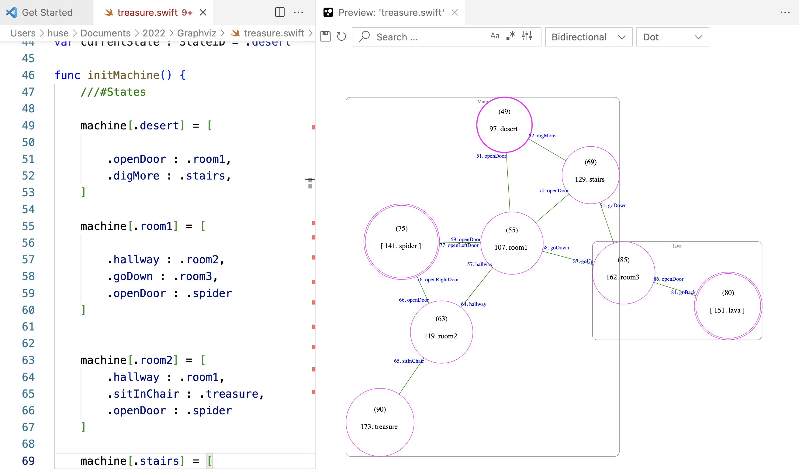

# FSM Swift Interactive Preview (Visual Studio Code Extension)

A VSCode extension that provides Finite State Machine diagrams, zoom-, pan-, live preview powered by Graphviz.



Test code:

```
    ///  bgcolor = gray12
    /// node [fontcolor = white];
    /// node [color = yellow];
    /// edge [fontcolor = orange]
    
    ///#Dot
    /// 
    /// start = 6;
    /// node [shape=circle];
    /// edge [len=4];
    /// node [color = magenta];
    
    ///#EndDot

enum MessageID : String {
    case openDoor
    case digMore
    case hallway
    case goDown
    case goUp
    
    case sitInChair
    case openLeftDoor
    case openRightDoor
    case goBack
}

enum StateID {
    
    case desert
    case room1
    case room2
    case stairs
    
    case spider
    case lava
    case room3
    case treasure
    
}

var machine : [StateID : [ MessageID : StateID] ] = [:]
var states : [StateID : Action] = [:]
var currentState : StateID = .desert

func initMachine() {
    ///#States
    
    machine[.desert] = [
    
        .openDoor : .room1,
        .digMore : .stairs,
    ]

    machine[.room1] = [
        
        .hallway : .room2,
        .goDown : .room3,
        .openDoor : .spider
    ]
    
   
    machine[.room2] = [
        .hallway : .room1,
        .sitInChair : .treasure,
        .openDoor : .spider
    ]
    
    machine[.stairs] = [
        .openDoor : .room1,
        .goDown : .room3
    ]
    
    ///#Subroutine
    machine[.spider] = [
        .openRightDoor : .room2,
        .openLeftDoor : .room1
    ]
    
    machine[.lava] = [
        .goBack : .room3,
        
    ]
    
    machine[.room3] = [
        .openDoor : .lava,
        .goUp : .room1
    ]

    machine[.treasure] = [

    ]
    ///#EndStates
}

func initStates() {
    states[.desert] = {

        debugPrint("state \(StateID.desert)")
    }
    
    states[.room1] = {

        debugPrint("state \(StateID.room1)")
    }
    
    states[.room2] = {

        debugPrint("state \(StateID.room2)")
    }
    
    states[.stairs] = {

        debugPrint("state \(StateID.stairs)")
    }
    
    
    
    states[.spider] = {

        debugPrint("state \(StateID.spider)")
    }
    
    states[.lava] = {
 
        debugPrint("state \(StateID.lava)")
    }
    
    states[.room3] = {
        
        debugPrint("state \(StateID.room3)")
    }
    
    states[.treasure] = {
        
        debugPrint("state \(StateID.treasure)")
    }
    
}


```


## Interactivity Features
* Renders dot/Graphviz sources in an interactive live preview.
* Updates preview as you type.
* Export the graph as `svg` or `dot`.


## How to preview

Open a Swift file in the active editor and use either of the following methods to render the preview:

* Open the command prompt (<kbd>cmd</kbd>+<kbd>shift</kbd>+<kbd>p</kbd>) and type  `> FSM Swift Interactive Preview`


## Development
You may need to fix folder issues
```
sudo chown -R $(whoami) /usr/local/lib/node_modules/
sudo chmod -R 775 /usr/local/lib/node_modules/
```
Install Dependencies:
```
npm install
npm audit fix 
```
Before running the project
```
npm run watch
```

## Credits

* Forked from Graphviz Interactive Preview: [link here](https://github.com/tintinweb/vscode-interactive-graphviz)


-----------------------------------------------------------------------------------------------------------
